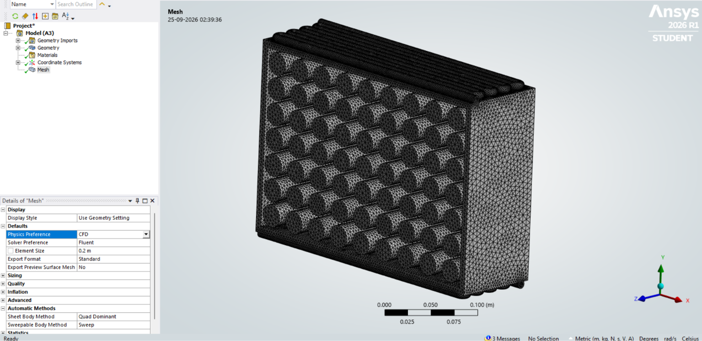

# Numerical Analysis of CO₂ in a Non-Circulating Loop for Battery Management Systems

## 📌 Project Overview

This project focuses on the **numerical analysis of CO₂ in a non-circulating cooling loop for Battery Management Systems (BMS)**.

The objective is to investigate the thermal behaviour of a battery pack and evaluate the potential of CO₂-based cooling for effective battery thermal management.

The project involves the development of a battery-pack cooling-system design, preparation of the computational mesh, and subsequent numerical analysis using CFD.

The **CAD design and mesh generation have been completed**. The remaining work involves setting up and performing the numerical simulation in **ANSYS Fluent** and analyzing the resulting thermal behaviour.

---

## 🎯 Objectives

- Develop a battery-pack cooling-system design for a non-circulating CO₂ cooling loop.
- Study the thermal behaviour of the battery pack.
- Perform numerical analysis of CO₂ flow and heat transfer.
- Determine the temperature distribution within the battery pack.
- Evaluate the cooling effectiveness of the proposed system.
- Identify areas for further thermal optimization based on CFD results.

---

## 📐 Battery Pack Specifications

| Parameter | Value |
|---|---:|
| Battery Pack Dimensions | 300 × 200 mm |
| Casing Thickness | 7.5 mm |
| Cell Height | 90 mm |
| Cell Diameter | 25 mm |
| Number of Cells | 63 |

---

## 🛠️ Software Used

- **Autodesk Fusion 360** – CAD modelling and battery-pack design
- **ANSYS Meshing** – Computational mesh generation
- **ANSYS Fluent** – Numerical/CFD analysis

---

## 🔧 Project Progress

### 1. CAD Design ✅

The battery-pack geometry and cooling-system configuration were designed using Autodesk Fusion 360.

The battery pack consists of **63 cylindrical cells** enclosed within the designed casing and cooling structure.

---

### 2. Computational Mesh Generation ✅

The completed CAD geometry was prepared for numerical analysis using ANSYS.

A computational mesh was generated for the battery-pack geometry to prepare the model for the subsequent CFD simulation.

#### Mesh Setup

- **Physics Preference:** CFD
- **Solver Preference:** Fluent
- **Element Size:** 0.2 m
- **Mesh Type:** Tetrahedral

---

## 🚧 Future Progress

The remaining stage of the project is the **numerical simulation of CO₂ in ANSYS Fluent**.

The future work will include:

### CFD Setup

- Import the generated mesh into ANSYS Fluent.
- Define the properties of CO₂.
- Define battery and casing material properties.
- Define the heat generation from the battery cells.
- Apply appropriate boundary conditions.
- Define the CO₂ flow and thermal conditions.
- Configure the required solver settings.

### Numerical Analysis

The simulation will be used to investigate:

- CO₂ flow behaviour
- Heat transfer between the battery pack and CO₂
- Battery temperature distribution
- Maximum battery temperature
- Temperature uniformity across the cells
- Heat dissipation from the battery pack
- Overall cooling effectiveness

### Design Evaluation

The simulation results will be analyzed to determine the effectiveness of the proposed non-circulating CO₂ cooling configuration.

Based on the numerical results, possible modifications to the cooling-system design can be identified to improve thermal performance.

---

## 📊 Expected Outcome

The primary goal of the numerical analysis is to understand the **thermal behaviour of the battery pack when subjected to CO₂-based cooling in a non-circulating loop**.

The CFD results will provide information about the temperature distribution, heat transfer behaviour, and cooling performance of the proposed system.

The results can subsequently be used to evaluate and optimize the cooling-system design.

---

## 📈 Project Status

| Project Stage | Status |
|---|---|
| Concept Development | ✅ Completed |
| Battery Pack CAD Design | ✅ Completed |
| Cooling-System Design | ✅ Completed |
| Computational Mesh Generation | ✅ Completed |
| CO₂ CFD Setup | 🚧 Future Work |
| Numerical Simulation | 🚧 Future Work |
| Thermal Analysis | 🚧 Future Work |
| Cooling Performance Evaluation | 🚧 Future Work |
| Design Optimization | 🚧 Future Work |

---

## 🔮 Future Work

The next phase of the project will focus on setting up the **CO₂ numerical model in ANSYS Fluent** and performing the required CFD simulations.

The resulting flow and thermal data will be analyzed to evaluate the performance of the non-circulating CO₂ cooling system and identify opportunities for further optimization.

---

## 📌 Current Project Status

**Completed:**  
CAD Design → Computational Mesh

**Future Work:**  
CO₂ CFD Setup → Numerical Simulation → Thermal Analysis → Performance Evaluation
